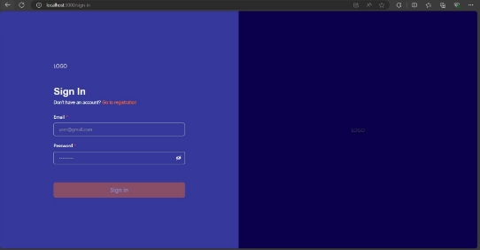
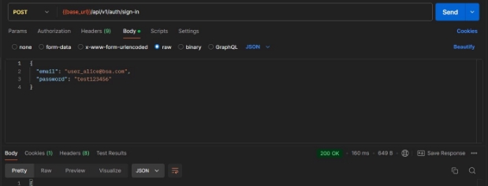
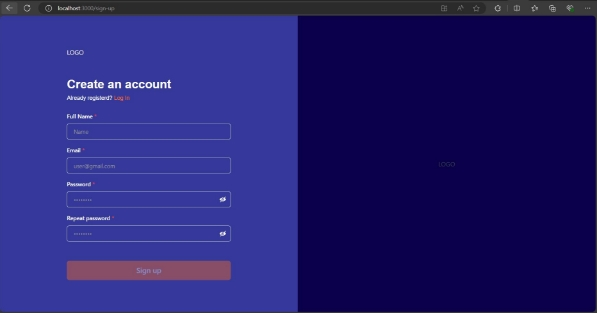
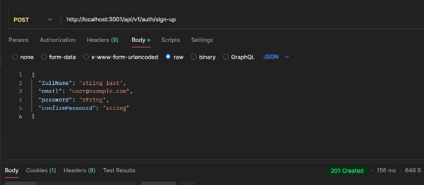

**Table of Contents![ref1]**

[**Sign in 2**](#_page1_x92.13_y70.87)

- [User Story](#_page1_x92.13_y477.58)
- [Test Cases Email field](#_page1_x92.13_y532.10)
- [Test Cases Password field](#_page1_x92.13_y595.63)
- [Acceptance Criteria (FE)](#_page2_x92.13_y70.87)
- [Acceptance Criteria (BE)](#_page2_x92.13_y420.83)

[**Sign up 4**](#_page3_x92.15_y72.00)

- [User Story](#_page3_x92.15_y477.34)
- [Test Cases Full Name field](#_page3_x92.15_y518.86)
- [Test Cases Email field](#_page3_x92.15_y574.38)
- [Test Cases Password field](#_page3_x92.15_y629.91)
- [Test Cases Repeat Password field](#_page4_x92.15_y72.00)
- [Acceptance Criteria (FE)](#_page4_x92.15_y140.61)
- [Acceptance Criteria (BE)](#_page5_x92.15_y72.00)![ref1]

    **Sign in**

    The "Sign In" page is designed to facilitate access for registered users to their existing accounts within the **OutreachVids** application. This page serves multiple purposes:

1. **User Authentication**: It securely captures the user's login credentials (e.g., email and password) and verifies them against the corresponding data stored in the database.
1. **Access Token Generation**: Upon successful authentication, the system generates and provides an access token, enabling the user to securely interact with the application.
1. **Password Recovery**: In cases where users have forgotten their passwords, the page offers a redirection link to the "Forgot Password" page, where they can initiate the password recovery process.
1. **Account Registration**: For unregistered users, the page includes a prompt to redirect them to the "Create an Account" page, allowing them to establish a new account within the app.

The "Sign In" page is a critical gateway, ensuring that only authenticated users gain access to the application while providing necessary avenues for those who need to recover or create accounts.

- **User Story**

The user story procedure on the next link [TestDoc_for_SignInFlow](https://docs.google.com/spreadsheets/d/14vF3EOa7sI515qRntANlLpbEsZBukRq-S1vcsAIy_wg/edit?gid=1922746335#gid=1922746335)

- **Test Cases Email field**

Test Cases in the next link [TestDoc_for_SignInFlow](https://docs.google.com/spreadsheets/d/14vF3EOa7sI515qRntANlLpbEsZBukRq-S1vcsAIy_wg/edit?gid=1854802596#gid=1854802596)

- **Test Cases Password field**

Test Cases in the next link [TestDoc_for_SignInFlow](https://docs.google.com/spreadsheets/d/14vF3EOa7sI515qRntANlLpbEsZBukRq-S1vcsAIy_wg/edit?gid=1854802596#gid=1854802596)

- **Frontend Testing**

Test Cases in the next link [TestDoc_for_SignInFlow(Frontend)](https://docs.google.com/spreadsheets/d/18qkQs1BYpclGpN9TGDBwBefp4q7TLVE2cnlwckDCbiI/edit?usp=sharing)

- **Acceptance Criteria (FE)**
- Display Login form with the fields Email, Password and Sign In button as designed in Figma template
- Allow the user to sign up using "Go to registration" link
- Show error messages when any field contains invalid data
- Show error messages when any field contains incorrect data
- Redirect the user to the Home screen after submission

- **Acceptance Criteria (BE)**
- Validate Email field input
- Validate Password field input
- Allow the user to continue as authenticated user after submission

**Sign up**

The "Sign Up" page in the **OutreachVids** application is designed to enable new users to create an account, granting them access to the platform's features. This page performs the following essential functions:

1. **Account Creation**: It captures the necessary user information, such as name, email, and password, and securely stores this data in the database to establish a new user account.
1. **User Authentication Setup**: Once the account is successfully created, the system generates an access token, allowing the new user to securely interact with the OutreachVids platform.
1. **Redirection to Sign In**: For users who already have an account, the page includes a link to the "Sign In" page, providing a seamless transition for users who may have mistakenly navigated to the "Sign Up" page.
1. **Error Handling and Validation**: The page incorporates robust validation mechanisms to ensure that all input data meets the required standards. In case of errors (e.g., email already in use, weak password), the system provides immediate feedback to guide the user.

The "Sign Up" page is a crucial entry point for new users, ensuring a smooth onboarding process while securely managing user data and authentication.

- **User Story**

The user story procedure on the next link [TestDoc_for_SignUpFlow](https://docs.google.com/spreadsheets/d/1b-xRyyn39r4N9k-P7zC618jotIVunZbbz1Vv9ipHNOM/edit?gid=1922746335#gid=1922746335)

- **Test Cases Full Name field**

Test Cases in the next link [TestDoc_for_SignUpFlow](https://docs.google.com/spreadsheets/d/1b-xRyyn39r4N9k-P7zC618jotIVunZbbz1Vv9ipHNOM/edit?gid=1854802596#gid=1854802596)

- **Test Cases Email field**

Test Cases in the next link [TestDoc_for_SignUpFlow](https://docs.google.com/spreadsheets/d/1b-xRyyn39r4N9k-P7zC618jotIVunZbbz1Vv9ipHNOM/edit?gid=1854802596#gid=1854802596)

- **Test Cases Password field**

Test Cases in the next link [TestDoc_for_SignUpFlow](https://docs.google.com/spreadsheets/d/1b-xRyyn39r4N9k-P7zC618jotIVunZbbz1Vv9ipHNOM/edit?gid=1854802596#gid=1854802596)

- **Acceptance Criteria (BE)**
- **Test Cases Repeat Password field**

Test Cases in the next link [TestDoc_for_SignUpFlow](https://docs.google.com/spreadsheets/d/1b-xRyyn39r4N9k-P7zC618jotIVunZbbz1Vv9ipHNOM/edit?gid=1854802596#gid=1854802596)

- **Acceptance Criteria (FE)**
- Add a new route /sign-up to the application's routing configuration and ensure that navigating to /sign-up renders the sign-up form.
- Develop a sign-up form that includes fields for user input, such as email, password, and any additional required fields (e.g., Full Name).
- Ensure the form is styled consistently with the application's design and UX guidelines.
- The sign-up form should be user-friendly and aligned with the layout used on the Sign In page if they share the same layout.
- Implement the functionality to handle form submission, including sending the data to the backend API for user registration.
- Upon successful form submission and authentication, the user should be redirected to the app's main page
- Implement client-side validation for the sign-up form fields to ensure that all required fields are correctly filled out and that the input data meets the validation criteria
- Display appropriate error messages for invalid input or failed sign-up attempts.

- The migration runs successfully without errors in all environments.
- Passwords are hashed using the encryption service before being stored in the database.
- The user service ensures that the password\_hash and password\_salt columns are excluded from the returned user object.
- A new /auth/sign-up endpoint is added to the controller.
- After successful sign-up, the endpoint returns a user object with id, email, fullName, and token, excluding password\_hash and password\_salt.

[ref1]: aspose.words.4040baa6-0049-4bf4-b1ac-017680cadc96.001.png
